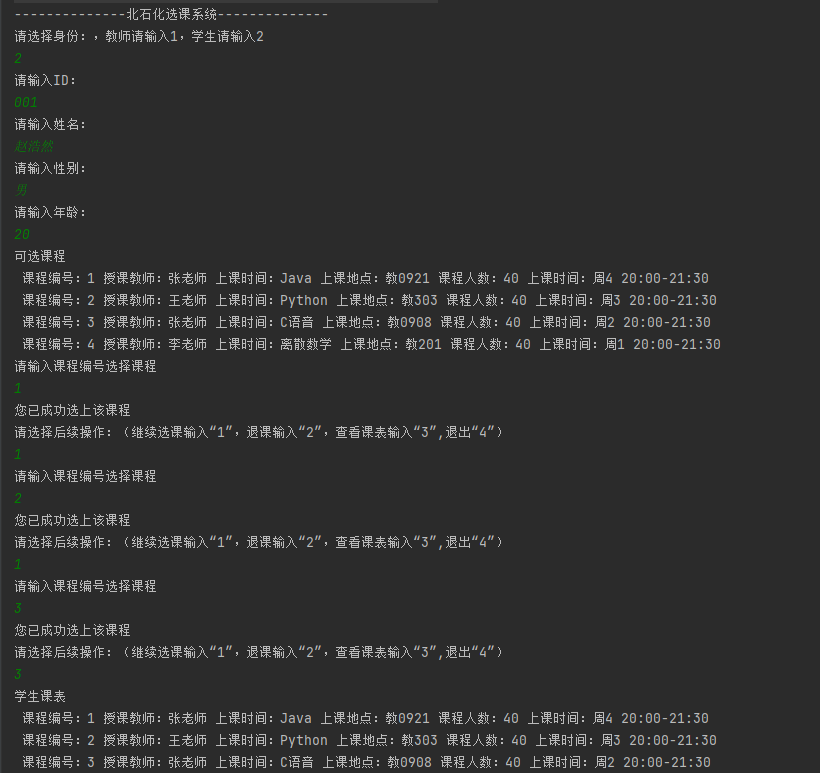

## 一、实验目的
1. 初步了解分析系统需求，从学生选课角度了解系统中的实体及其关系，学会定义类中的属性以及方法。
2. 掌握面对对象的类设计方法（属性、方法）。
3. 掌握通过构造方法实例化对象。
4. 学会使用数组。
## 二、业务要求
&emsp;&emsp;学校人员分为“教师”和“学生”，教师教授“课程”，学生选择“课程”。每名教师可讲授**多门**课程，每名学生可选修**多门**课程。
<br>&emsp;&emsp;多门课程，可用课程数组形式表达。
<br>&emsp;&emsp;对象示例：教师（编号、姓名、性别、所授课程)
<br>&emsp;&emsp;&emsp;&emsp;&emsp;&emsp;&emsp;学生(编号、姓名、性别、所选课程)
<br>&emsp;&emsp;&emsp;&emsp;&emsp;&emsp;&emsp;课程(编号、课程名称、上课地点、时间)
<br>&emsp;&emsp;以上属性仅为示例，同学们可以自行扩展。
## 三、实验要求
1. 编写上述实体类以及测试主类
2. 在测试主类中，实例化多个类实体
   <br>1)教师开设某课操作；
   <br>2)学生选课操作、退课操作
   <br>3)打印学生课表信息(包括：编号、课程名称、上课地点、时间、授课教师等
3. 编写实验报告。
## 四、实验过程
1. 首先根据实验要求，创建实体类三个，分别是Student,Course,Teacher;以及测试类Testing;并将这些类放在同一个包(Testing)里。（Testing包里是最终版本，Class包里是第一版）
2. 在Course类中，设置局部变量课程编号（id），课程名称(name)，上课地点(place)，上课时间(time)，上课日期(week)，授课教师(teacher)，学生数量(stu_num)。并设置构造函数初始化对象参数。
3. 在Teacher类中，设置局部变量编号(id)，姓名(name)，性别(sex)，一个课程类对象(course)用来增加课程到教师的个人课表，以及一个课程类数组(c[])用来储存所有该教师的课程。
4. 在Student类中，设置局部变量编号(id)，姓名(name)，性别(sex)，年龄(age)，一个课程类对象(course)用来增加课程到教师的个人课表，以及一个课程类数组(c[])用来储存所有该教师的课程。
5. 在Testing类中，设置主函数，创建一个课程数组，并实例化几门课程，存入数组中。
6. 在实现教师和学生的登录时，首先让登陆者选择身份。
7. 如果是教师登录，则通过收集教师填入的信息，初始化一个Teacher对象；然后通过遍历循环已有课程数组，对比课程数组中每一个课程的授课老师和教师的姓名，将两个变量的值相同的项，写入该教师的课程数组里。
8. 在Teacher类中，设置show()函数，输出所有储存在教师数组中的课程信息（授课教师除外）；在主函数中调用，并输出该教师的课程表。
9. 如果是学生登录，同样通过收集其填入信息，来初始化一个Student对象；然后输出所有的课程信息供学生参考选课。
10. 默认学生初次登录需要选一门课程后才能做后续操作；因此通过获取学生输入的课程编号，与课程数组中编号想对应的方式，找出学生所选的课程对象，加入到学生个人的课程数组中。
11. 然后，询问学生是否进行下一步操作（继续选课，退课，显示课表等）或者退出。
12. 若继续选课，则同11步操作。
13. 若退课，则调用Student类中的drop_course函数，通过遍历个人课表数组中所有课程的序号与学生输入的想要退课的课程序号相对比。
采取新建一个数组，将处去需要删掉的课程外其他课程放入新数组，然后最后用新数组代替旧数组的形式实现删除一门课程。
14. 若选择显示课表，则通过调用Student类中的show()函数来实现。
15. 若无需继续操作，可选择退出，结束进程。否则继续选择需要的操作，直至完成一切所需操作。
## 五、流程图

## 六、主要代码
1.通过（类名[] 数组名 = new 类名）的格式，创建一个课程数组，并初始化多个课程变量，存入数组。
``` java
        Course[] C = new Course[20];
        Course c1 = new Course(1,"Java","教0921","20:00-21:30",4,40,"张老师");
        C[0] = c1;
```
2. 通过Scanner类，来接受输入；以此来判断身份。同理得到教师或学生的个人信息。
``` java
        Scanner in = new Scanner(System.in);
        System.out.println("请选择身份：，教师请输入1，学生请输入2"); //判断身份
        int iddd = in.nextInt();
```
3.通过遍历循环，对比课程数组中每一个课程的授课老师和教师的姓名，将两个变量的值相同的项，写入该教师的课程数组里。
``` java
            int k = 0;
            for (int j = 0; j <= C.length; j++) {
                if (C[j] == null) {
                    break;
                }
                else {
                    if (tea.name.equals(C[j].teacher)) {
                        tea.add_course(C[j]);
                    }
                    else {
                        continue;
                    }
                }
            }
```
4.Teacher类中的show函数，通过遍历，显示所有非空课程数组项的课程信息。同时给课程编号，方便记录课程数量。
``` java
    void show(){
        System.out.println(this.name+"的课表");
        int k = 1;
        for(int i=0;i<=this.i;i++) {
            if (c[i] == null) {
                continue;
            }
            else {
                System.out.print("课程"+ k);
                System.out.print(" 课程编号："+c[i].id);
                System.out.print(" 上课时间："+c[i].name);
                System.out.print(" 上课地点："+c[i].place);
                System.out.print(" 课程人数："+c[i].stu_num);
                System.out.println(" 上课时间：周"+c[i].week +" "+ c[i].time);
                k++;
            }
```
5. Student类中的课程添加相关函数。主要是排除空数组对象，并将已选课程加入学生的个人课程数组。
``` java
    void add_course(int class_id,Course[] C){
        for(int a=0;a<=C.length;a++) {
            if (C[a] == null) {
                break;
            } else {
                if (class_id == C[a].id) {
                    addcourse(C[a]);
                    break;
                } else {
                    continue;
                }
            }
        }
    }
    void addcourse(Course cc){
        course = cc;
        c[i] = course;
        i++;
    }
```
6. 删除课程，Student类中的drop_course函数。重点内容是采取新建一个数组，将处去需要删掉的课程外其他课程放入新数组，然后最后用新数组代替旧数组的形式实现删除一门课程。
``` java
    void drop_course(int id){
        Course[] d = new Course[5];
        int j = 0;
        for(int i=0;i<=this.i;i++) {
            if (c[i] == null) {
                continue;
            }
            else {
                System.out.println(c[i].id);
                if (id == c[i].id) {
                    continue;
                }
                else {
                    d[j] = c[i];
                    j++;
                }
                c = d;
            }
        }
    }
```
## 七、运行截图
#### 教师登录界面

#### 学生登录界面

## 八、感想体悟
&emsp;&emsp;对于这次实验，相对来说有很大难度，开始感觉不知所措，不知道从哪下手，首先通过对需求分析，进行流程图的画图，逐渐清楚从哪开始，渐渐有了头绪，从主函数到各个类之间的调用，对于学生、教师等需求的设计。通过网络查询，程序设计思路，有了很大的进步，虽然有些功能不是很完善，
但总的来讲，本次实验收获颇丰，希望以后能将java学的更加通透，感受更多编程的乐趣！
